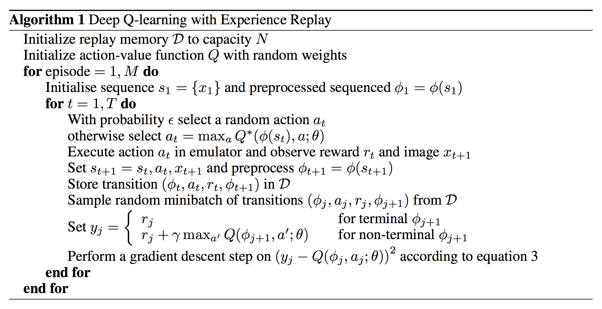

### Deep Reinforcement Learning with Deep Q-Learning algorithm 

Implementation of Atari Breakout using Deep Reinforcement Leaerning. The agent learns how to play atari game using **Deep Q-Learning (DQN)** algorithm.

    
     
    <em>DQN agent learned how to play atari game.</em>

Deep Q-Learning is is a model-free reinforcement learning algorithm that uses a Q-network, a target network and replay buffer to train the agent. The general form of DQN algorithm is:

    
     
    <em>Deep Q-Learning algorithm.</em>

